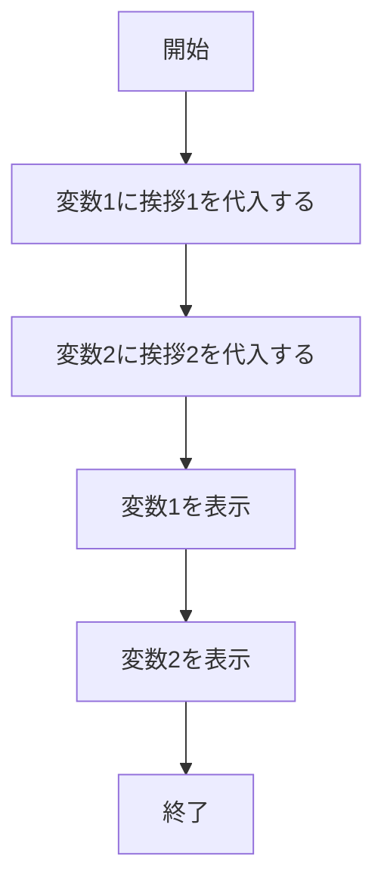
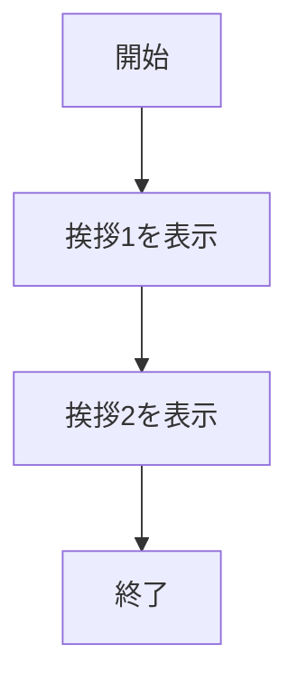
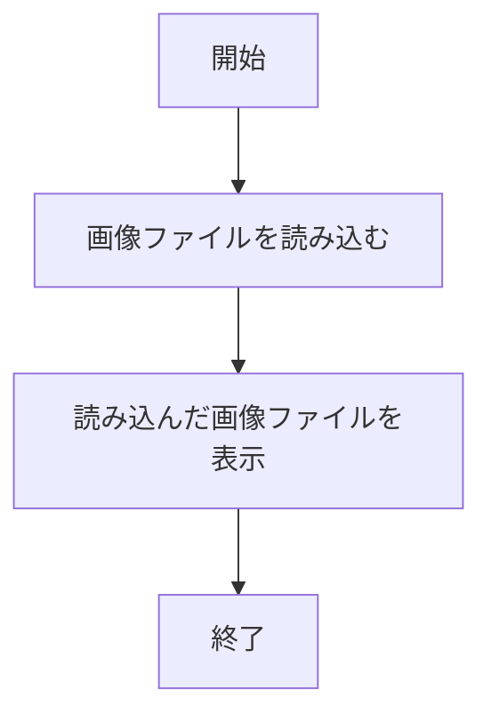
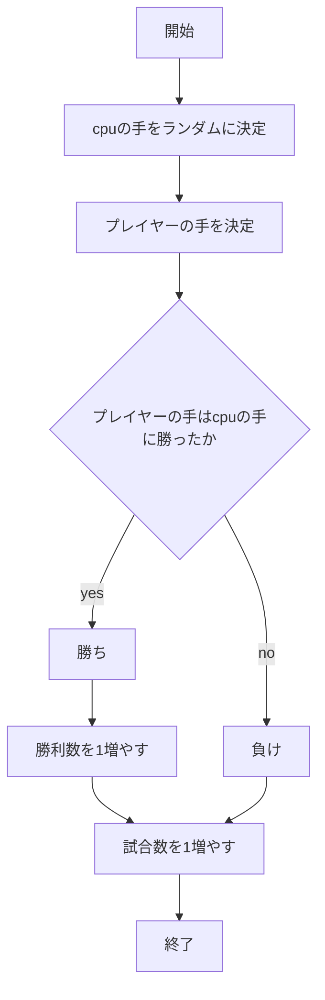
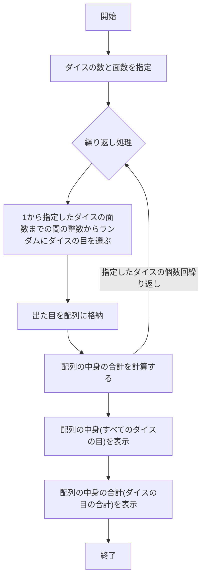
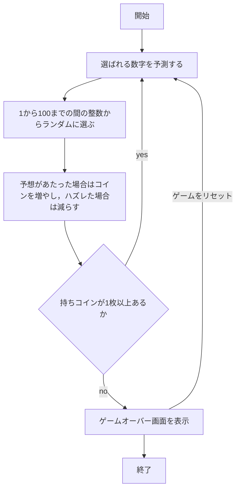

# webpro_06

## 挨拶その1

### ファイル一覧
ファイル名 | 説明
-|-
app5.js | プログラム本体
views/hello1.ejs | 挨拶その1の表示コード

### 使用手順
1. ターミナルでapp5.js を起動する(node app5.js)
1. 別のターミナルを開き8080のポートに対応させる(telnet localhost 8080)
1. 8080ポートに挨拶その1のプログラムを読み込ませる
(GET /hello1 HTTP/1.1
Host: localhost)
1. Webブラウザで[http://localhost:8080/hello1]にアクセスする

### フローチャート

## 挨拶その2

### ファイル一覧
ファイル名 | 説明
-|-
app5.js | プログラム本体
views/hello2.ejs | 挨拶その2の表示コード

### 使用手順
1. ターミナルでapp5.js を起動する(node app5.js)
1. 別のターミナルを開き8080のポートに対応させる(telnet localhost 8080)
1. 8080ポートに挨拶その2のプログラムを読み込ませる
(GET /hello2 HTTP/1.1
Host: localhost)
1. Webブラウザで[http://localhost:8080/hello2]にアクセスする

### フローチャート

## アイコン

### ファイル一覧
ファイル名 | 説明
-|-
app5.js | プログラム本体
views/icon.ejs | iconの表示コード
public/Apple_logo_black.svg | 表示させる画像ファイル

### 使用手順
1. ターミナルでapp5.js を起動する(node app5.js)
1. 別のターミナルを開き8080のポートに対応させる(telnet localhost 8080)
1. 8080ポートにアイコンのプログラムを読み込ませる
(GET /icon HTTP/1.1
Host: localhost)
1. Webブラウザで[http://localhost:8080/icon]にアクセスする

### フローチャート

## じゃんけん

### ファイル一覧
ファイル名 | 説明
-|-
app5.js | プログラム本体
public/janken.html | じゃんけんの開始画面
views/janken.ejs | じゃんけんの表示コード

### 使用手順
1. ターミナルでapp5.js を起動する(node app5.js)
1. 別のターミナルを開き8080のポートに対応させる(telnet localhost 8080)
1. 8080ポートにじゃんけんのプログラムを読み込ませる
(GET /janken HTTP/1.1
Host: localhost)
1. Webブラウザで[http://localhost:8080/janken]にアクセスする
1. 自分の手を入力する

### フローチャート

## 複合ダイス

### ファイル一覧
ファイル名 | 説明
-|-
app5.js | プログラム本体
public/dice.html | 複合ダイスの開始画面
views/dice.ejs | 複合ダイスの表示コード

### 使用手順
1. ターミナルでapp5.js を起動する(node app5.js)
1. 別のターミナルを開き8080のポートに対応させる(telnet localhost 8080)
1. 8080ポートに複合ダイスのプログラムを読み込ませる
(GET /dice HTTP/1.1
Host: localhost)
1. Webブラウザで[http://localhost:8080/dice]にアクセスする
1. 振りたいダイスの個数と面数(出てくる数の最大値)を指定する

### フローチャート

## ルーレット

### ファイル一覧
ファイル名 | 説明
-|-
app5.js | プログラム本体
public/roulette.html | ルーレットの開始画面
views/roulette1.ejs | ルーレットの表示コード
views/roulette2.ejs | ルーレットのゲームオーバー表示コード

### 使用手順
1. ターミナルでapp5.js を起動する(node app5.js)
1. 別のターミナルを開き8080のポートに対応させる(telnet localhost 8080)
1. 8080ポートにルーレットのプログラムを読み込ませる
(GET /roulette HTTP/1.1
Host: localhost)
1. Webブラウザで[http://localhost:8080/roulette]にアクセスする
1. ルーレットで次に出てくる数字が偶数,奇数,51以上,51未満かを予想してコインを賭ける
1. 予想があたったら賭けたコインが倍になって返ってくる
1. コインを全て無くしたらゲームオーバー(再びやりたい場合はリセットボタンを押す)

### フローチャート
