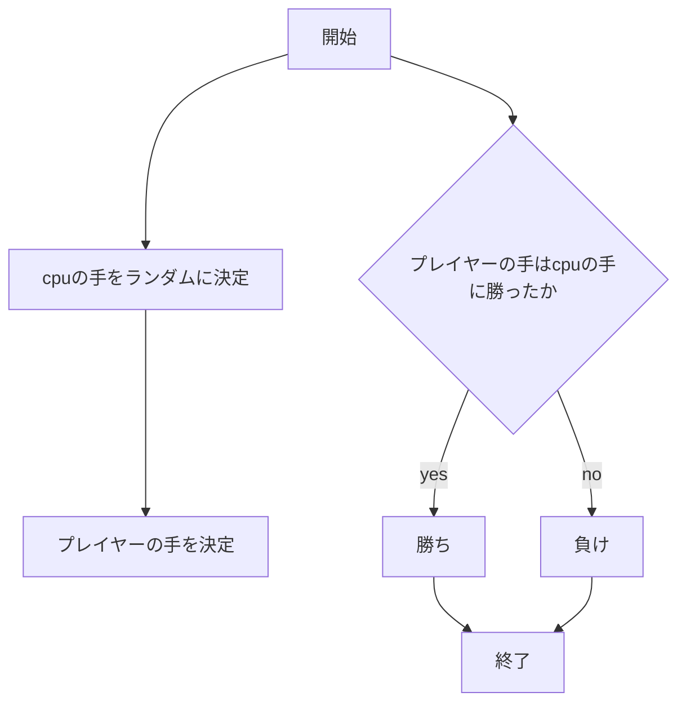

# webpro_06
2024/10/29
## このプログラムについて

## ファイル一覧


### じゃんけん
ファイル名 | 説明
-|-
app5.js | プログラム本体
public/janken.html | じゃんけんの開始画面
views/janken.ejs | じゃんけんの表示コード

```javascript
console.log( 'Hello' );
```

1. ターミナルでapp5.js を起動する(node app.js)
1. 別のターミナルを開き8080のポートに対応させる(telnet localhost 8080)
1. 8080ポートにじゃんけんのプログラムを読み込ませる
(GET /janken HTTP/1.1
Host: localhost)
1. Webブラウザで[http://localhost:8080/janken]にアクセスする
1. 自分の手を入力する



GET /dice HTTP/1.1
Host: localhost