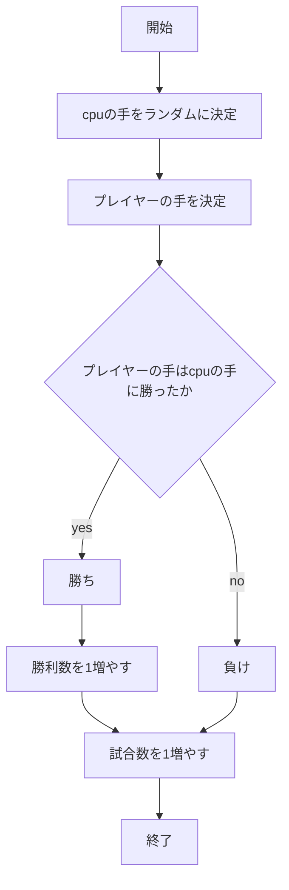
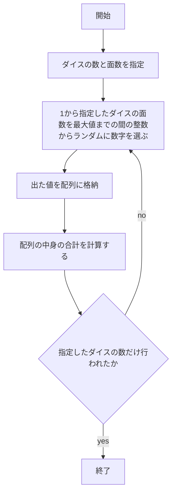

# webpro_06
2024/10/29

## じゃんけん

### ファイル一覧
ファイル名 | 説明
-|-
app5.js | プログラム本体
public/janken.html | じゃんけんの開始画面
views/janken.ejs | じゃんけんの表示コード

### 使用手順
1. ターミナルでapp5.js を起動する(node app5.js)
1. 別のターミナルを開き8080のポートに対応させる(telnet localhost 8080)
1. 8080ポートにじゃんけんのプログラムを読み込ませる
(GET /janken HTTP/1.1
Host: localhost)
1. Webブラウザで[http://localhost:8080/janken]にアクセスする
1. 自分の手を入力する

### フローチャート

## 複合ダイス

### ファイル一覧
ファイル名 | 説明
-|-
app5.js | プログラム本体
public/dice.html | 複合ダイスの開始画面
views/dice.ejs | 複合ダイスの表示コード

### 使用手順
2. ターミナルでapp5.js を起動する(node app5.js)
2. 別のターミナルを開き8080のポートに対応させる(telnet localhost 8080)
2. 8080ポートに複合ダイスのプログラムを読み込ませる
(GET /dice HTTP/1.1
Host: localhost)
2. Webブラウザで[http://localhost:8080/dice]にアクセスする
2. 振りたいダイスの個数と面数(出てくる数の最大値)を指定する

### フローチャート
